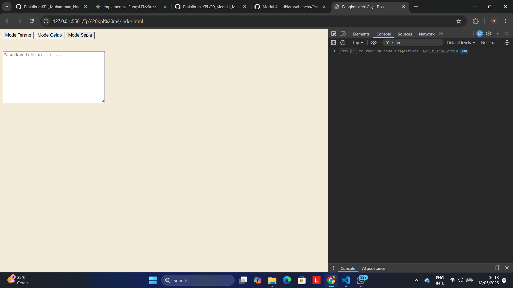

Tugas Mandiri: GUI dengan HTML dan CSS

Identitas Mahasiswa
* **Nama:** Muhammad Naufal Hanif
* **NIM:** 103122400057
* **Kelas:** SE-08-02
* **Program Studi:** Rekayasa Perangkat Lunak (Software Engineering)
* **Instansi:** Telkom University Purwokerto

Soal
Tambahkan fitur **Mode Sepia** pada aplikasi web "Pengkonversi Gaya Teks" dengan ketentuan parameter estetika sebagai berikut:
* **Warna Latar Belakang:** `#F4ECD8`
* **Warna Teks:** `#5B4636`
* Elemen formulir masukan teks (`textarea`) harus tetap dipertahankan berwarna putih murni.
* Struktur tombol `light`, `dark`, dan `sepia` wajib berada di dalam naungan komponen kontainer berupa `mode-div`.
* Perpindahan antar-tema (*state transition*) harus berjalan secara mulus pada dokumen aplikasi web.

Implementasi struktur antarmuka, penataan gaya, dan logika perpindahan tema diintegrasikan secara modular ke dalam tiga berkas terpisah yang saling terhubung.

* Tautan Berkas HTML: [index.html](./index.html)
* Tautan Berkas CSS: [index.css](./index.css)
* Tautan Berkas JavaScript: [index.js](./index.js)

1. Struktur Antarmuka (`index.html`)
```html
<!DOCTYPE html>
<html lang="id">
<head>
    <meta charset="UTF-8">
    <title>Pengkonversi Gaya Teks</title>
    <link rel="stylesheet" href="index.css">
</head>
<body>

    <div id="mode-div">
        <button id="light" onclick="changeMode('light')">Mode Terang</button>
        <button id="dark" onclick="changeMode('dark')">Mode Gelap</button>
        <button id="sepia" onclick="changeMode('sepia')">Mode Sepia</button>
    </div>

    <br><br>
    <textarea id="text-input" placeholder="Masukkan teks di sini..."></textarea>

    <script src="index.js"></script>
</body>
</html>



